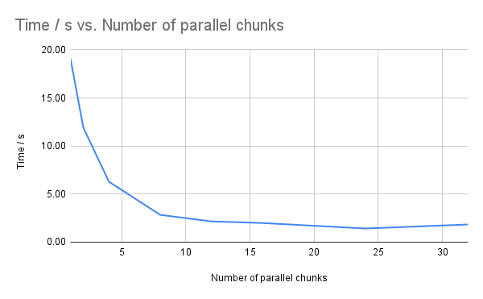

## Parallel Processing Sobel Filter

The Sobel filter supports processing the image in parallel by dividing the image into chunks before filtering.

The below table shows how the number of parallel chunks affect processing time.

| Number of parallel chunks | Time (ms) |
| ------------------------- | --------- |
| 1                         | 19097.103 |
| 2                         | 11925.856 |
| 4                         | 6286.248  |
| 8                         | 2835.470  |
| 12                        | 2159.409  |
| 16                        | 1987.026  |
| 24                        | 1419.594  |
| 32                        | 1840.091  |

> This test was ran on an AMD Ryzen 9 5900X 12-Core Processor which has 12 cores and 24 logical processors.

